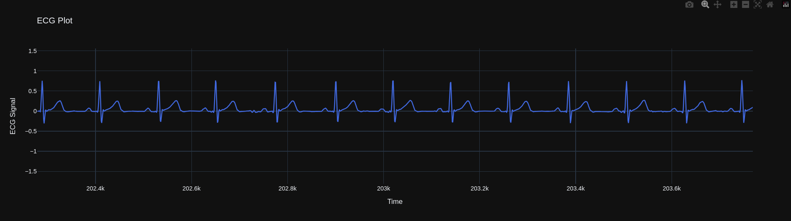
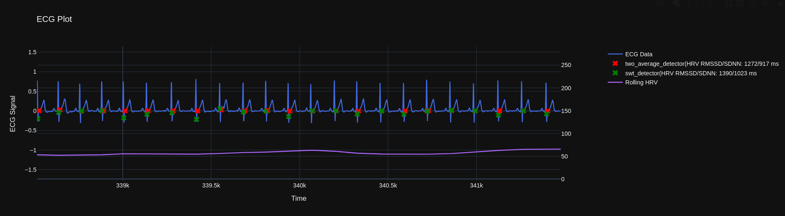

# Healforce PC80B

A package to parse SCP file exported from a PC80B into ECG curves that are suitable for analysis. This package is adapted from [healforcescpecg](https://github.com/KaibinBao/healforcescpecg) to use the PC80B instead of the PC180D.

## What is the PC80B

The PC80B is an inexpensive electrocardiogram sold for roughly $80 on AliExpress, it is somewhat better than comparatively cheap ECGs because it uses leads (electrodes) that can be applied directly to the chest instead of requiring you to hold the device. 

